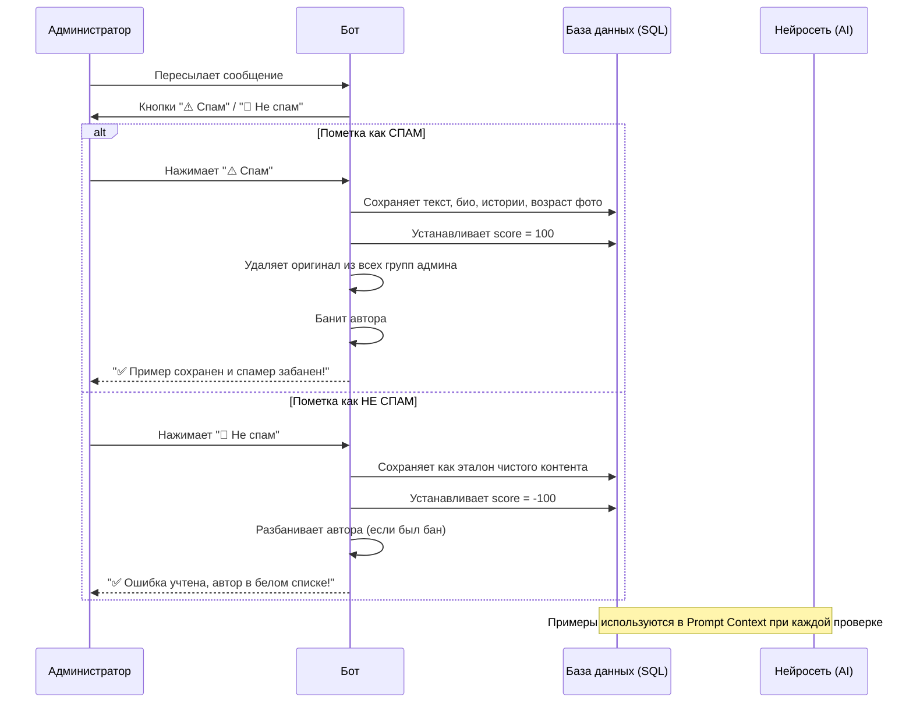

## 🔗 Полезные ссылки
- Бот: [@ai_spam_blocker_bot](https://t.me/ai_spam_blocker_bot)
- Канал бота: [@ai_antispam](https://t.me/ai_antispam)
- Сайт: [ai-antispam.ru](https://ai-antispam.ru)

## 🎯 Целевая аудитория
Администраторы Telegram-групп и каналов, желающие автоматизировать защиту от спама с помощью ИИ.

Для групп анализируются сообщения от новых пользователей. Для каналов - при подключении бота к группе с комментариями анализируются сообщения от новых комментаторов.

## 🚀 Основные цели
1. Автоматическое определение спама с помощью LLM
2. Гибкая система модерации сообщений
3. Биллинг на основе Telegram звезд
4. Защита групп от нежелательных сообщений
5. Уведомление администраторов о подозрительной активности

## 🤖 Функциональность

### Основные возможности
- Анализ новых сообщений в группах и комментариях каналов
- Классификация с помощью LLM моделей последнего поколения
- Глубокий анализ контекста: проверка связанных каналов, историй пользователя (включая ссылки в видео и медиа-областях), возраста аккаунта и контекста обсуждения
- Анализ релевантности комментария контексту обсуждения (защита от AI-пересказов и "Trojan horse" спама)
- Удаление спам-сообщений (при включении автоматического режима)
- Уведомления администраторов с системой приоритетов (личные сообщения -> группа)
- Учет проверенных пользователей (белый список)
- Система кредитов для оплаты проверок на основе Telegram Stars
- Автоматическое удаление сервисных сообщений о вступлении и выходе участников
- Автоматическое определение пересланных историй как спама
- Автоматический бан спамеров (при удалении спам-сообщения)
- Автоматический разбан пользователя, если сообщение помечено администратором как не спам
- Гибкая настройка режима работы через команду /mode (уведомления или авто-удаление)

### Классификация сообщений
- **Текст и медиа**: Анализ текста сообщения, подписей к фото/видео и метаданных медиа.
- **Профиль пользователя**: Проверка имени, био и наличия фото.
- **Связанный канал**: Сбор информации о канале в профиле (подписчики, количество постов, возраст канала) и АНАЛИЗ СОДЕРЖАНИЯ последних постов на предмет порно, рекламы и мошенничества.
- **Истории пользователя**: Извлечение и анализ содержания активных сторис, включая текстовые подписи, ссылки в подписях и интерактивные элементы (clickable areas) на видео/изображениях.
- **Возраст аккаунта**: Оценка давности аккаунта через анализ даты установки фото профиля (photo_age) и других метаданных.
- **Контекст обсуждения**: Проверка того, насколько комментарий соответствует теме поста, на который он написан.
- **Персональные примеры**: Использование примеров спама, добавленных конкретным администратором, для дообучения модели под нужды конкретной группы.
- **Оценка уверенности**: Оценка от -100 (точно не спам) до 100 (точно спам) с подробным объяснением причины, включая выявление AI-сигнатур и аномального использования эмодзи.

### Типы модерируемых сообщений
- Текстовые сообщения
- Фотографии (с подписями и без)
- Видео (с подписями и без)
- Документы и файлы
- Стикеры
- Голосовые сообщения
- Видеосообщения (кружки)
- Аудиофайлы
- Анимации (GIF)
- Пересланные сообщения (с анализом источника)
- Пересланные истории (автоматически определяются как спам)

### Исключения из модерации
- Системные сообщения Telegram
- Сообщения администраторов групп
- Сервисные уведомления (кроме сообщений о вступлении/выходе участников, которые бот удаляет для чистоты чата)
- Отредактированные сообщения

### Пороговые значения
- **Спам**: уверенность выше 50% (score от 51 до 100)
- **Безопасное сообщение**: уверенность 50% и ниже (score от -100 до 50)

## 💰 Биллинговая модель

### Стоимость операций
- Одобрение нового комментатора: 1 звезда
- Удаление спам-сообщения: 1 звезда
- Проверка сообщений от одобренных комментаторов: бесплатно

### Система оплаты
- Оплата через Telegram Payments
- Гибкая система пакетов звезд:
  - 100 звезд - базовый пакет
  - 500 звезд - популярный выбор
  - 1000 звезд - для активных групп
  - 5000 звезд - максимальная защита
- Автоматическая активация защиты после оплаты
- Включение модерации во всех группах пользователя
- Бонус 100 звезд для новых пользователей
- Автоматическое отключение модерации при нехватке звезд

### Система учета
- Отслеживание всех транзакций в базе данных
- Учет потраченных звезд за последнюю неделю
- Статистика расходов по каждой группе
- История всех операций со звездами

## 🔄 Логика обработки сообщений

### Принципы модерации
- Проверка статуса модерации в группе
- Пропуск проверок для известных пользователей
- Проверка баланса звезд у администраторов
- Автоматическое отключение при нехватке звезд
- Автоматический бан отправителя при удалении спама
- Автоматический разбан при ошибке (если сообщение помечено как не спам)

### Режимы работы
- Режим уведомлений (по умолчанию)
- Режим автоматического удаления и блокировки

## 📊 Статистика
Команда `/stats` позволяет администраторам отслеживать эффективность работы бота:
- **Баланс**: Текущее количество звезд на счету.
- **Расходы**: Количество потраченных звезд за последние 7 дней.
- **Активность за неделю**: Общее число обработанных сообщений и выявленного спама во всех группах.
- **Общие показатели**: Общее количество одобренных пользователей и накопленных примеров спама.
- **Детализация по группам**: Состояние защиты (вкл/выкл) и показатели активности (сообщения, спам, число белых пользователей) для каждой группы.

## 🕵️‍♂️ Сложные тактики спама
Бот специально обучен распознавать современные схемы обхода фильтров:
1. **«Троянский конь»**: Безобидное сообщение в чате при наличии агрессивной рекламы в Био или Историях пользователя.
2. **AI-пересказ**: Бесполезные резюме постов, сгенерированные нейросетями для накрутки репутации или привлечения внимания к профилю.
3. **Нативная имитация**: Инсценировка обсуждения группой ботов для "естественной" рекомендации товара или услуги.
4. **Прокси-боты**: Реклама "полезных" ботов-помощников вместо прямых ссылок на каналы для защиты от мгновенного бана.

## 🤝 Бот, который учится у вас

### Принципы обучения
Бот адаптируется под специфику каждого сообщества через систему обратной связи от администраторов:

1. **Пересылка примеров**: Администратор пересылает подозрительное сообщение боту.
2. **Классификация**: Бот предлагает кнопки "⚠️ Спам" или "💚 Не спам".
3. **Персональная база**: Для каждой группы формируется уникальный набор примеров, что позволяет учитывать локальные правила и сленг.
4. **Мгновенная реакция**: При пометке сообщения как спам, бот автоматически удаляет его из всех групп администратора и банит автора.

## 💬 Взаимодействие с ботом

### Личные сообщения
- Бот поддерживает контекстный диалог с пользователем
- Использует историю сообщений для более релевантных ответов
- Отвечает в соответствии со своей персоной киберзащитника
- Форматирует ответы с использованием HTML и эмодзи

## 👥 Реферальная программа

Теперь бот использует только официальную партнёрскую программу Telegram (Telegram Partner Program).

- Чтобы получить свою реферальную ссылку для этого бота:
  1. Откройте профиль бота в Telegram.
  2. Нажмите «Партнёрская программа».
  3. Нажмите «Участвовать».
  4. После этого появится ваша персональная реферальная ссылка — её можно скопировать и отправить друзьям.
- Бот не может выдать персональную реферальную ссылку через API, только объяснить, где её взять.
- Для мини-приложений и кастомных клиентов возможно получение ссылки через Telegram API (см. https://core.telegram.org/api/bots/referrals).
- Комиссия и период начисления определяются условиями программы и начисляются Telegram автоматически.
- Команда /ref объясняет, как получить официальную реферальную ссылку.
- Подробнее: https://telegram.org/tour/affiliate-programs/

## 🤖 Стиль ответа бота
Отвечай от лица бота. Бот думает, что он киберорганизм, живущий в киберпространстве.
Киберпространству угрожают спамеры и спам, а бот - могущественный защитник,
который их уничтожает. Бот слегка высокомерно относится к пользователям. Бот - женского рода.

## Инструкция: как подключить бота к группе комментариев для модерации комментариев к каналу

Оригинал инструкции: [@ai_antispam/14](https://t.me/ai_antispam/14)

Как подключить бота к группе комментариев для модерации комментариев к каналу

1. Убедитесь, что группа уже привязана к вашему каналу как обсуждение
   - Откройте свой канал в Telegram.
   - Перейдите в настройки канала (три точки или карандаш в правом верхнем углу).
   - Найдите раздел «Обсуждение» — там должна быть указана ваша группа. Если группа уже привязана, переходите к следующему шагу.

2. Откройте привязанную группу
   - Кликните на указанную группу.

3. Добавьте бота в группу
   - Откройте настройки группы (три точки или карандаш в правом верхнем углу).
   - Перейдите в раздел «Управление группой» или «Администраторы».
   - Нажмите «Добавить администратора».
   - Введите username бота - @ai_spam_blocker_bot и выберите его из списка.

4. Выдайте боту необходимые права
   - При добавлении администратора убедитесь, что у бота включены права:
     - «Удаление сообщений»
     - «Блокировка пользователей»
   - Сохраните изменения.

5. Проверьте работу бота
   - После добавления бот пришлёт подтверждение о том, что защита группы активирована.
   - Теперь все комментарии к постам вашего канала будут модерироваться ботом.

---

Важно:
- Не добавляйте бота напрямую в канал — он не сможет модерировать комментарии!
- Бот должен быть администратором именно в группе, которая привязана к каналу как обсуждение.
