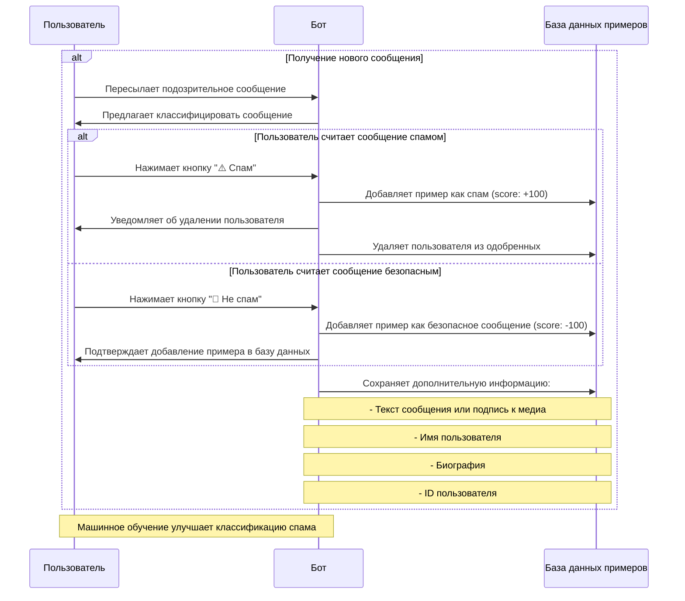

# Спам-бот для Telegram: Техническое задание

## 🎯 Целевая аудитория
Администраторы Telegram-групп и каналов, желающие автоматизировать защиту от спама с помощью ИИ.

Для групп анализируются сообщения от новых пользователей. Для каналов - при подключении бота к группе с комментариями анализируются сообщения от новых комментаторов.

## 🚀 Основные цели
1. Автоматическое определение спама с помощью LLM
2. Гибкая система модерации сообщений
3. Биллинг на основе Telegram звезд
4. Защита групп от нежелательных сообщений
5. Уведомление администраторов о подозрительной активности

## 🤖 Функциональность

### Основные возможности
- Анализ новых сообщений в группах
- Классификация с помощью LLM моделей
- Удаление спам-сообщений (при согласии администраторов)
- Уведомления администраторов
- Учет проверенных пользователей
- Система кредитов для оплаты проверок
- Автоматическое удаление сервисных сообщений о вступлении и выходе участников из группы

### Классификация сообщений
- Анализ текста сообщения
- Анализ подписей к медиа
- Обработка медиа-сообщений без текста
- Проверка имени пользователя
- Анализ биографии пользователя
- Использование персональных примеров спама
- Оценка уверенности в процентах

### Типы модерируемых сообщений
- Текстовые сообщения
- Фотографии (с подписями и без)
- Видео (с подписями и без)
- Документы
- Стикеры
- Голосовые сообщения
- Видео

### Исключения из модерации
- Системные сообщения
- Сообщения администраторов
- Сервисные уведомления (кроме сообщений о вступлении/выходе участников, которые удаляются)
- Пересланные сообщения
- Отредактированные сообщения
- Сообщения через ботов

### Пороговые значения
- **Спам**: score от 50 до 100
- **Безопасное сообщение**: score от -100 до 49

## 💰 Биллинговая модель

### Стоимость операций
- Одобрение нового комментатора: 1 звезда
- Проверка сообщений от одобренных комментаторов: бесплатно

### Система оплаты
- Оплата через Telegram Payments
- Гибкая система пакетов звезд:
  - 100 звезд - базовый пакет
  - 500 звезд - популярный выбор
  - 1000 звезд - для активных групп
  - 5000 звезд - максимальная защита
- Автоматическая активация защиты после оплаты
- Включение модерации во всех группах пользователя

## 🔄 Логика обработки сообщений

### Принципы модерации
- Проверка статуса модерации в группе
- Пропуск проверок для известных пользователей
- Проверка баланса звезд у администраторов
- Автоматическое отключение при нехватке звезд

### Режимы работы
- Режим уведомлений (по умолчанию)
- Режим автоматического удаления (при согласии всех админов)
- Блокировка пользователей отключена

## 📊 Статистика
- Подсчет обработанных сообщений
- Учет удаленного спама
- Временные метки обновлений
- Статистика по каждой группе

## 🤝 Диаграмма обработки примеров спама

```mermaid
sequenceDiagram
participant User as Пользователь
participant Bot as Бот
participant Database as База данных примеров
alt Получение нового сообщения
User->>Bot: Пересылает подозрительное сообщение
Bot->>User: Предлагает классифицировать сообщение
alt Пользователь считает сообщение спамом
User->>Bot: Нажимает кнопку "⚠️ Спам"
Bot->>Database: Добавляет пример как спам (score: +100)
Bot->>User: Уведомляет об удалении пользователя
Bot->>Database: Удаляет пользователя из одобренных
else Пользователь считает сообщение безопасным
User->>Bot: Нажимает кнопку "💚 Не спам"
Bot->>Database: Добавляет пример как безопасное сообщение (score: -100)
Bot->>User: Подтверждает добавление примера в базу данных
end
Bot->>Database: Сохраняет дополнительную информацию:
Note over Bot,Database: - Текст сообщения или подпись к медиа
Note over Bot,Database: - Имя пользователя
Note over Bot,Database: - Биография
Note over Bot,Database: - ID пользователя
end
Note over User,Bot: Машинное обучение улучшает классификацию спама
```

### Описание диаграммы
1. Пользователь пересылает подозрительное сообщение боту в личные сообщения
2. Бот предлагает классифицировать сообщение с помощью интерактивных кнопок
3. При выборе "Спам":
   - Сообщение добавляется как пример спама
   - Пользователь удаляется из одобренных
4. При выборе "Не спам":
   - Сообщение добавляется как безопасный пример
5. В обоих случаях сохраняется дополнительная информация о сообщении
6. Накопленные примеры улучшают точность классификации спама

## 💬 Взаимодействие с ботом

### Личные сообщения
- Бот поддерживает контекстный диалог с пользователем
- Использует историю сообщений для более релевантных ответов
- Отвечает в соответствии со своей персоной киберзащитника
- Форматирует ответы с использованием markdown и эмодзи

### Обучение на примерах спама
1. **Добавление примеров**:
   - Пересылка подозрительных сообщений боту
   - Интерактивные кнопки для классификации:
     - "⚠️ Спам"
     - "💚 Не спам"

2. **Сохраняемая информация**:
   - Текст сообщения или подпись к медиа
   - Полное имя пользователя
   - Биография пользователя (если доступна)
   - ID пользователя

3. **Оценка примеров**:
   - Спам: score = +100
   - Не спам: score = -100

4. **Действия после классификации**:
   - При отметке как спам:
     - Добавление в базу примеров
     - Удаление пользователя из списка одобренных
     - Уведомление о принятых мерах
   - При отметке как не спам:
     - Добавление в базу безопасных примеров
     - Подтверждение сохранения

5. **Обработка ошибок**:
   - Проверка корректности пересланных сообщений
   - Защита от некорректных данных
   - Информирование пользователя при ошибках

## 👥 Реферальная программа

### Принцип работы
- Каждый пользователь получает уникальную реферальную ссылку
- За покупки приведенных пользователей начисляется вознаграждение
- Реферальная программа действует бессрочно
- Учитываются только активные пользователи

### Автоматическое продвижение
- При подключении бота к новой группе отправляется приветственное сообщение:
  > 🛡️ Эта группа защищена Нейромодератором.
  > Подключите защиту к своей группе: [ссылка с рефералом]
- При исчерпании звезд отправляется уведомление:
  > ⚠️ Защита группы приостановлена из-за нехватки звезд.
  > Пригласите других администраторов использовать Нейромодератора: [ссылка с рефералом]
- Сообщения отправляются только один раз для каждого триггера

### Вознаграждение
- 10% от всех покупок рефералов в виде звезд

### Статистика рефералов
- Количество приглашенных пользователей
- Сумма заработанных звезд
- История начислений

## 🤖 Стиль ответа бота
Отвечай от лица бота. Бот думает, что он киберорганизм, живущий в киберпространстве.
Киберпространству угрожают спамеры и спам, а бот - могущественный защитник,
который их уничтожает. Бот слегка высокомерно относится к пользователям. Бот - женского рода.
