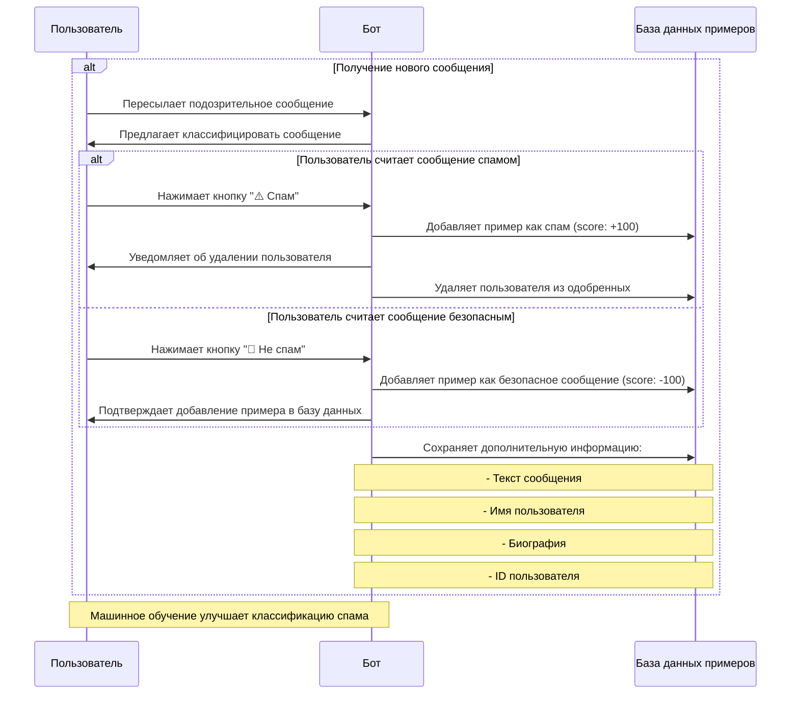

# Спам-бот для Telegram: Техническое задание

## 🎯 Целевая аудитория
Администраторы Telegram-групп и каналов, желающие автоматизировать защиту от спама с помощью ИИ.

Для групп анализируются сообщения от новых пользователей. Для каналов - при подключении бота к группе с комментариями анализируются сообщения от новых комментаторов.

## 🚀 Основные цели
1. Автоматическое определение спама с помощью LLM
2. Гибкая система модерации сообщений
3. Биллинг на основе Telegram звезд
4. Защита групп от нежелательных сообщений
5. Уведомление администраторов о подозрительной активности

## 🤖 Функциональность

### Основные возможности
- Анализ новых сообщений в группах
- Классификация с помощью LLM моделей
- Удаление спам-сообщений (при согласии администраторов)
- Уведомления администраторов
- Учет проверенных пользователей
- Система кредитов для оплаты проверок

### Классификация сообщений
- Анализ текста сообщения
- Проверка имени пользователя
- Анализ биографии пользователя
- Использование персональных примеров спама
- Оценка уверенности в процентах

### Пороговые значения
- **Спам**: score > 50 (автоматическая обработка)
- **Безопасное сообщение**: score ≤ 50 (добавление в белый список)

## 💰 Биллинговая модель

### Стоимость операций
- Одобрение нового комментатора: 1 звезда
- Проверка сообщений от одобренных комментаторов: бесплатно

### Система оплаты
- Оплата через Telegram Payments
- Покупка пакетов по 100 звезд
- Автоматическая активация защиты после оплаты
- Включение модерации во всех группах пользователя

## 🔄 Логика обработки сообщений

### Принципы модерации
- Проверка статуса модерации в группе
- Пропуск проверок для известных пользователей
- Проверка баланса звезд у администраторов
- Автоматическое отключение при нехватке звезд

### Режимы работы
- Режим уведомлений (по умолчанию)
- Режим автоматического удаления (при согласии всех админов)
- Блокировка пользователей отключена

## 📊 Статистика
- Подсчет обработанных сообщений
- Учет удаленного спама
- Временные метки обновлений
- Статистика по каждой группе

## 🤝 Диаграмма обработки примеров спама

### Описание диаграммы
1. Пользователь пересылает подозрительное сообщение боту в личные сообщения
2. Бот предлагает классифицировать сообщение с помощью интерактивных кнопок
3. При выборе "Спам":
   - Сообщение добавляется как пример спама
   - Пользователь удаляется из одобренных
4. При выборе "Не спам":
   - Сообщение добавляется как безопасный пример
5. В обоих случаях сохраняется дополнительная информация о сообщении
6. Накопленные примеры улучшают точность классификации спама

## 💬 Взаимодействие с ботом

### Личные сообщения
- Бот поддерживает контекстный диалог с пользователем
- Использует историю сообщений для более релевантных ответов
- Отвечает в соответствии со своей персоной киберзащитника
- Форматирует ответы с использованием markdown и эмодзи

### Обучение на примерах спама
1. **Добавление примеров**:
   - Пересылка подозрительных сообщений боту
   - Интерактивные кнопки для классификации:
     - "⚠️ Спам"
     - "💚 Не спам"

2. **Сохраняемая информация**:
   - Текст сообщения или подпись к медиа
   - Полное имя пользователя
   - Биография пользователя (если доступна)
   - ID пользователя

3. **Оценка примеров**:
   - Спам: score = +100
   - Не спам: score = -100

4. **Действия после классификации**:
   - При отметке как спам:
     - Добавление в базу примеров
     - Удаление пользователя из списка одобренных
     - Уведомление о принятых мерах
   - При отметке как не спам:
     - Добавление в базу безопасных примеров
     - Подтверждение сохранения

5. **Обработка ошибок**:
   - Проверка корректности пересланных сообщений
   - Защита от некорректных данных
   - Информирование пользователя при ошибках

## 🤖 Персона бота
Киберорганизм в киберпространстве. Позиционирует себя как могущественный защитник, который не блокирует спамеров, а уничтожает их. Слегка высокомерно относится к пользователям.
