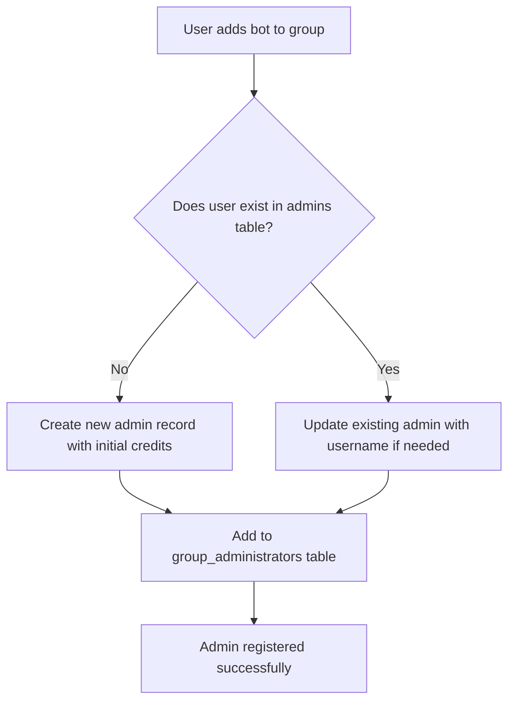
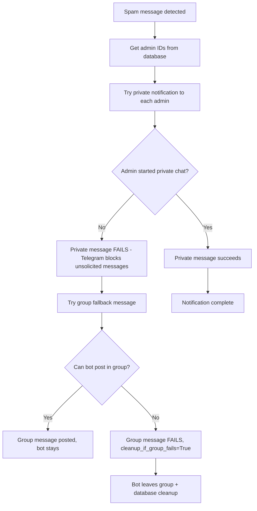
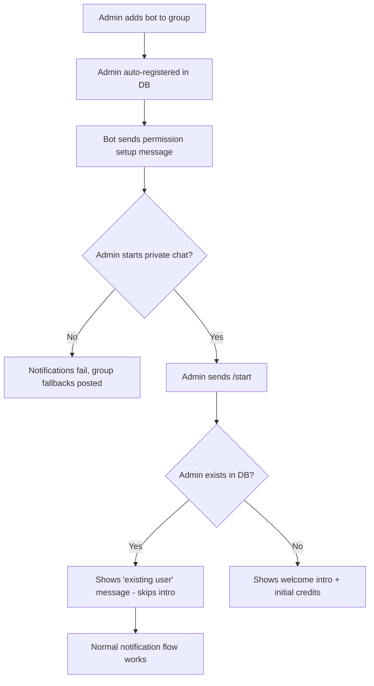

## System Patterns

- **Runtime Architecture**: `aiohttp` web application exposes Telegram webhook endpoint, forwards updates to a shared `aiogram` dispatcher hosted in `src/app/handlers`. Execution wrapped with `logfire` spans for observability and guarded by timeout/error helpers. Logfire metrics (histograms and gauges) initialized once at module level to ensure proper recording.
- **Bot Composition**:
  - `src/app/common` encapsulates integrations: Telegram bot client, LLM providers, Mixpanel tracking, notifications, shared utilities, and spam classifier logic.
  - `src/app/handlers` are organized by intent (callbacks, commands, payments, spam handling) and register with the dispatcher via side effects on import.
- **Data Access Layer**: `src/app/database` offers explicit operation modules (admins, groups, messages, spam examples) built atop a PostgreSQL connection helper, keeping SQL isolated from business logic.
- **Spam Decision Flow**: Updates route through filters that skip admins/service messages.
  - **Text Analysis**: Message content is analyzed by LLM.
  - **Context Enrichment**:
    - **Linked Channel**: Checks for suspicious channel stats (low subs, new channel) via MTProto.
    - **User Stories**: Fetches user stories via MTProto `stories.getPeerStories` to detect hidden spam payloads (links, scam offers) in profiles.
    - **Account Age**: Estimates account age via User ID range and checks profile photo date via `users.getFullUser` to penalize brand new accounts (ID > 6B, recent photo).
  - **Decision**: LLM scores content based on text, profile bio, linked channel stats, stories, and account age.
  - **Action**: High scores (>50%) trigger either auto-deletion/ban (if admin has delete_spam=True) or notifications only (if delete_spam=False, new user default).
  - **Permission Failures**: "message can't be deleted" errors trigger admin notifications with private→group fallback.
  - **User Mode Control**: /mode command allows users to toggle between notification-only and auto-deletion modes.
- **Billing & Credits**: Telegram Stars payments handled by dedicated handlers coupled with database operations that maintain balances, histories, and automatic moderation toggles when credits drop.
- **Linked Channel Extraction**: Direct MTProto approach with username-first resolution (bot API never provides linked channel information). Tries username first, then falls back to user ID. Essential for comprehensive spam detection requiring channel context.
- **Channel Message Handling**: Messages sent on behalf of channels (sender_chat present) are moderated using the channel's ID (`sender_chat.id`) as the effective user ID. This prevents the generic "Channel Bot" user (136817688) from being approved and whitelisting all channel spam. The system distinguishes between linked channels (auto-forwards) and channel spam using `check_skip_channel_bot_message`.
- **Configuration & Startup**: `.env` loaded in `src/app/main.py`, logging initialized before dispatcher registration (with `SKIP_LOGFIRE`/pytest detection skipping Logfire so local tests keep console output). Web app run via `aiohttp.web`. Tests rely on `pytest` with fixtures under `src/tests` mirroring production modules.
- **Notification System**: Admin notifications use private→group fallback with optimized bot detection. Pre-filtered admin lists skip expensive API calls (assume_human_admins=True), while untrusted lists use full API validation. Bot removal events trigger enhanced logging showing who performed the removal. Database operations separated from business logic with dedicated cleanup functions. Logfire instrumentation provides automatic start/finish logging with argument extraction and return value recording.
- **Database Integrity**: Stored procedures include bot filtering (negative IDs, known bot accounts). Admin lists prevent bot contamination through API validation and database-level checks. Cleanup operations properly separate connection management from business logic.
- **Observability & Incident Response**: All warnings/errors funnel through the standard logging stack with full tracebacks; `logger.warning` must include `exc_info=True` when exceptions exist. Incidents emit Mixpanel events, critical failures notify the admin chat, and recurring issues get grouped for trend analysis and frequency tracking.
- **Telegram Messaging Conventions**: Outbound messages respect Telegram limits and escape reserved characters for HTML mode. AI prompts include explicit HTML formatting instructions.
- **Graceful Shutdown**: On SIGINT/SIGTERM, `aiohttp` triggers shutdown hooks that clean up resources in order: stop background tasks, close bot session, close DB pool.
- **Admin Registration & Notification Behavior**: Admins are auto-registered when they add the bot to groups, but notifications fail for admins who haven't started private chats. See Admin Registration Flow diagram below.

## Admin Registration & Notification Flow

### When Admins Get Added to Database

**Key Points:**
- Admin registration happens automatically when bot is added to group
- No requirement for admin to have started private chat
- Initial credits (100) assigned to new admins
- Admin can be registered without ever interacting with bot privately

### Notification Failure Scenario

**Failure Impact:**
- Private notifications fail silently for admins who haven't started chats
- Group fallback messages posted instead (confusing UX)
- Bot may exit group if it can't post fallback messages
- Core spam detection/deletion still works, but notifications are broken

### Admin Onboarding Experience

**UX Problems:**
- Admins miss onboarding experience (welcome text, feature explanation)
- Get confusing group messages instead of clean private notifications
- Appear to have "broken" bot until they start private chat
