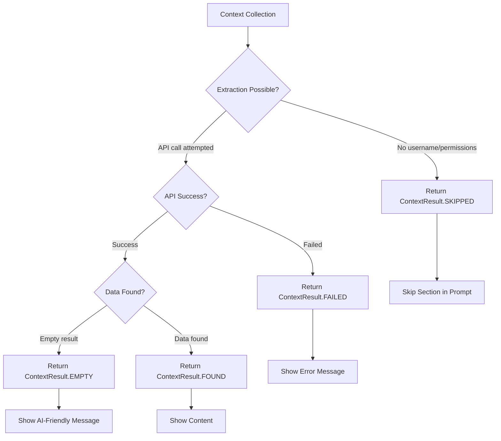
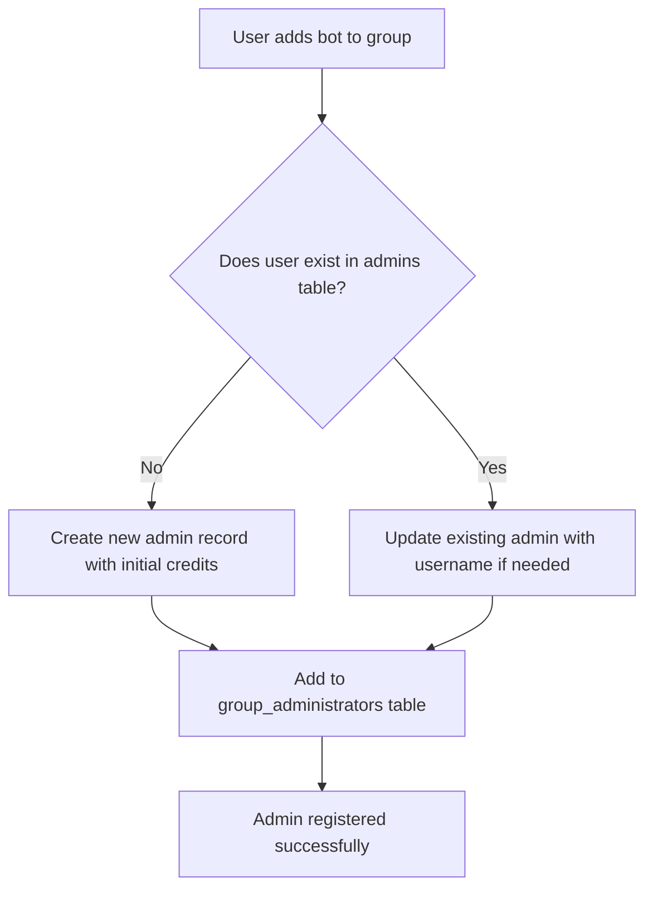
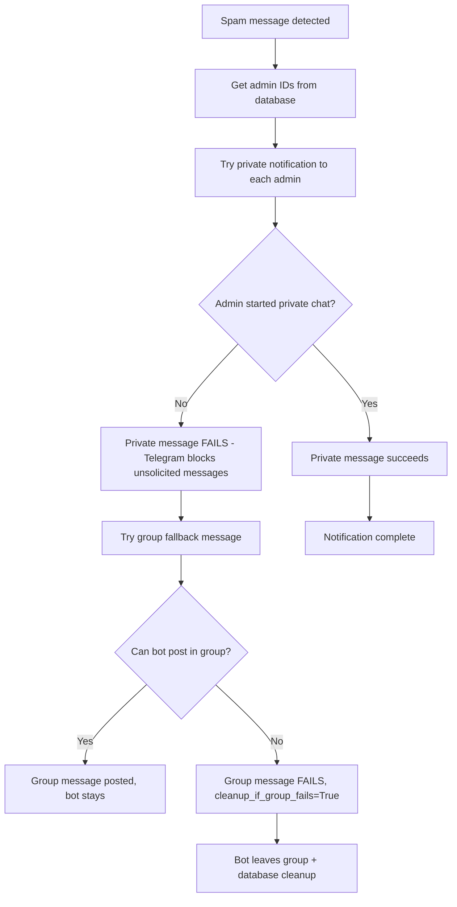
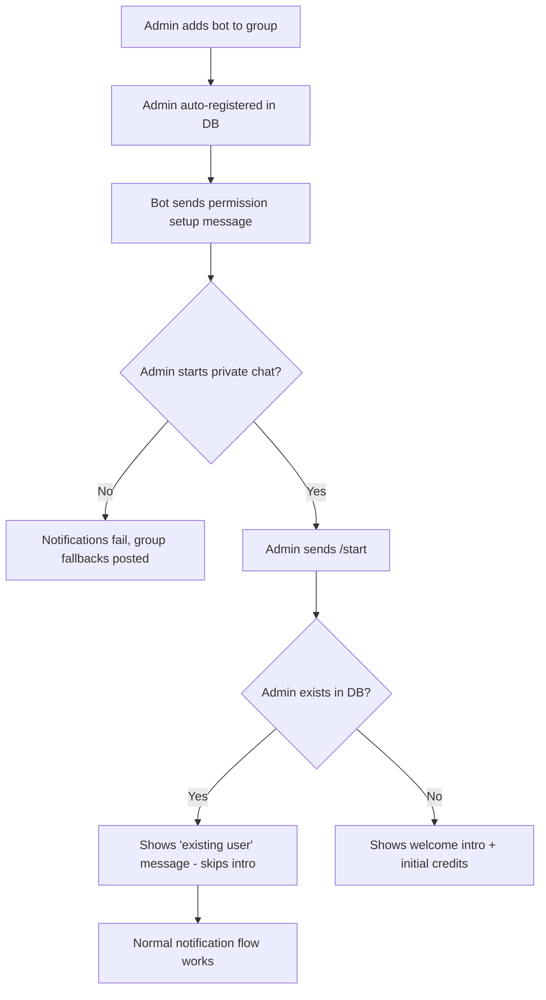

## System Patterns

- **Runtime Architecture**: `aiohttp` web application exposes Telegram webhook endpoint, forwards updates to a shared `aiogram` dispatcher hosted in `src/app/handlers`. Execution wrapped with `logfire` spans for observability and guarded by timeout/error helpers. Logfire metrics (histograms and gauges) initialized once at module level to ensure proper recording. Handler return values determine logfire span tags - handlers must return descriptive strings to avoid "_ignored" tagging.
- **Bot Composition**:
  - `src/app/common` encapsulates integrations: Telegram bot client, LLM providers, notifications, and shared utilities.
  - `src/app/spam` contains spam detection and context collection: classifier logic, context types, user profile analysis, story processing, and message context extraction.
  - `src/app/handlers` are organized by intent with modular substructure:
    - **Core handlers** by type (callbacks, commands, payments, spam handling)
    - **Message processing modules** under `handlers/message/`:
      - `pipeline.py` - Core moderation pipeline orchestration
      - `validation.py` - Message validation and permission checks
      - `channel_management.py` - Channel-specific operations and notifications
    - All handlers register with the dispatcher via side effects on import.
- **Data Access Layer**: `src/app/database` offers explicit operation modules (admins, groups, messages, spam examples) built atop a PostgreSQL connection helper, keeping SQL isolated from business logic.
- **Spam Decision Flow**: Updates route through filters that skip admins/service messages and edited messages.
  - **Text Analysis**: Message content is analyzed by LLM.
  - **Context Enrichment**:
    - **Unified Sender Metadata Collection**: `route_sender_context_collection` consolidates all sender context gathering and basic metadata extraction (name, bio) in a single function, eliminating the previous split between context collection and metadata extraction. For user senders, fetches bio via Telegram API; for channel senders, uses chat description as bio.
    - **Linked Channel**: Checks for suspicious channel stats (low subs, new channel) via MTProto AND analyzes recent post content for spam indicators (porn, ads, scams). **Unified context collection** enables analysis for both user profiles AND channel senders. On-demand user bot subscription enables collection for users without usernames (only for public channels with usernames).
    - **User Stories**: Fetches all active user stories via MTProto `stories.getPeerStories` (not just pinned ones) to detect hidden spam payloads (links, scam offers) in profiles. **Unified subscription system** ensures availability for all users.
    - **Account Age**: Estimates account age via User ID range and checks profile photo date via `users.getFullUser` to penalize brand new accounts (ID > 6B, recent photo).
    - **Discussion Thread Context**: For messages in discussion groups linked to channels, **optimized peer resolution** skips user bot subscription (since discussion groups may be private) and uses **thread-based reading only** via `messages.getReplies` to establish MTProto peer resolution for users without usernames. **Forum vs Discussion Distinction**: Correctly distinguishes between forum topic messages (`is_topic_message: true`) and discussion thread messages using the `is_topic_message` field, applying appropriate context collection strategies for each. **Main Channel Derivation**: For discussion thread messages (replies to channel posts), main channel information is extracted directly from `reply_to_message.sender_chat` rather than relying on `chat.linked_chat_id`, providing more reliable channel identification. **Main Channel Username Preference**: `messages.getReplies` prioritizes main channel username over discussion group parameters when establishing peer context, improving reliability for public channel access. **PeerResolutionContext Fields**: Renamed `linked_chat_id`/`linked_chat_username` to `main_channel_id`/`main_channel_username` for semantic clarity. **Synchronous Context Creation**: `create_peer_resolution_context_from_message` is now synchronous for the main extraction logic, with async API calls moved to the caller when needed, reducing unnecessary async overhead. **Message Object Optimization**: Context collection functions accept either full message objects or individual parameters, eliminating redundant field extraction and improving maintainability across different calling contexts (message processing vs. callbacks).
  - **Decision**: LLM scores content based on text, profile bio, linked channel stats/content, stories, and account age.
  - **Action**: High scores (>50%) trigger either auto-deletion/ban (if admin has delete_spam=True) or notifications only (if delete_spam=False, new user default).
  - **Permission Failures**: "message can't be deleted" errors trigger admin notifications with private→group fallback.
  - **Command Handling Policy**: All bot commands (except /help) are only accepted in private chats. Commands sent in group chats are ignored and deleted to prevent other users from accidentally triggering them. /help commands in groups display a message directing users to start a private conversation with the bot.
- **Logfire Message Lookup**: System for recovering original message metadata (chat ID, message ID, user ID) from forwarded messages when metadata is missing (e.g., hidden users).
    - **Edited Message Support**: Correctly identifies messages even if they were edited by checking both `message` and `edited_message` Logfire attributes.
    - **Robust Text Matching**: Uses word-based `LIKE` patterns to match message content even when hidden characters (like zero-width spaces or word joiners) are present.
- **User Mode Control**: /mode command allows users to toggle between notification-only and auto-deletion modes (private chat only).
- **Billing & Credits**: Telegram Stars payments handled by dedicated handlers coupled with database operations that maintain balances, histories, and automatic moderation toggles when credits drop.
- **Context Collection**: Unified system handles both user profiles and channel senders. User context includes stories, linked channels, and account age. Channel senders are analyzed as linked channels with subscriber stats, post history, and content analysis. On-demand user bot subscription enables collection for users without usernames (only for public channels with usernames). Private channels without usernames are gracefully skipped.
  - **MTProto Peer Context Establishment**: Critical preparation phase for collecting user context when usernames are unavailable. System establishes MTProto peer resolution by strategically reading messages to build entity relationships in the MTProto session. **Channel-Linked Discussion Threads**: For discussion groups linked to channels, system reads from the **public channel** (not the potentially private discussion group) using the original channel post ID extracted from forwarded messages (`forward_from_message_id`). **Main Channel Username Resolution**: When establishing peer context for discussion threads, system fetches and uses the main channel username for `messages.getReplies` calls, preferring username over ID for better MTProto compatibility. **Regular Groups & Forum Topics**: Use optimized `messages.getHistory` with membership pre-check to avoid unnecessary ~1.2s join operations for already-joined chats. **Membership Pre-check**: Fast `messages.getHistory` call (~0.1s) checks if user bot is already member before attempting join. **Error Classification (Option 2B)**: Distinguishes permanent errors (`CHAT_PRIVATE`, `USER_NOT_PARTICIPANT`, invalid IDs) from transient errors (network, timeout) to determine join strategy. **Strategic Reading**: `messages.getReplies` for thread-based context in discussion threads, `messages.getHistory` for regular groups and forum topics. Distinguishes between forum topics (`is_topic_message: true`) and discussion threads using Telegram Bot API fields for optimal peer resolution and comprehensive spam analysis. **Private Chat Handling**: Chats without usernames return `False` immediately (no join possible).
- **Channel Message Handling**: Messages sent on behalf of channels (sender_chat present) are moderated using the channel's ID (`sender_chat.id`) as the effective user ID. This prevents the generic "Channel Bot" user (136817688) from being approved and whitelisting all channel spam. The system distinguishes between linked channels (auto-forwards) and channel spam using `check_skip_channel_bot_message`.
- **Configuration & Startup**: `.env` loaded in `src/app/main.py`, logging initialized before dispatcher registration (with `SKIP_LOGFIRE`/pytest detection skipping Logfire so local tests keep console output). Web app run via `aiohttp.web`. Tests rely on `pytest` with fixtures under `tests/` mirroring production modules.
- **Testing Structure**:
  - **Unit Tests**: Fast, reliable tests using mocked dependencies and local test databases (SQLite/PostgreSQL). Run during deployment (83 tests).
  - **Integration Tests**: Tests requiring external services (Telegram API) stored in `tests/integration/`. Excluded from deployment via `@pytest.mark.integration`.
  - **Test Execution**: `pytest` with `--maxfail=1 --exitfirst -q` during deployment, only unit tests pass (93 total).
- **LLM Model Evaluation**:
  - **Evaluation Script**: `scripts/eval_llm_models.py` provides comprehensive testing infrastructure for spam classification models.
  - **Balanced Test Cases**: Automatically balances spam vs legitimate examples from database to prevent skewed accuracy metrics.
  - **Model Isolation**: Temporarily overrides MODELS list to test individual models without affecting global state.
  - **Hierarchical Progress Bars**: Uses `tqdm` with `position` parameters (0 for models, 1 for test cases, `leave=False` for inner bars) to prevent display conflicts.
  - **Results Storage**: Automatically saves complete evaluation results to `eval_results/` directory as timestamped JSON files with full metadata.
  - **DRY Architecture**: Helper functions eliminate repetitive code for error handling, formatting, and calculations.
- **Notification System**: Admin notifications use private→group fallback with optimized bot detection. Pre-filtered admin lists skip expensive API calls (assume_human_admins=True), while untrusted lists use full API validation. Bot removal events trigger enhanced logging showing who performed the removal. Database operations separated from business logic with dedicated cleanup functions. Logfire instrumentation provides automatic start/finish logging with argument extraction and return value recording.
- **Database Integrity**: Stored procedures include bot filtering (negative IDs, known bot accounts). Admin lists prevent bot contamination through API validation and database-level checks. Cleanup operations properly separate connection management from business logic.
- **Context Preparation Contract**: All context preparation code (stories, account age, linked channel, reply context) MUST follow a strict ContextResult contract using status enums to distinguish between extraction states:

### Context State Contract

**ContextResult Status Enum:**
- **`FOUND`** - **Data Found**: Context extraction succeeded and found data. Section is **included** in prompt with actual content.
- **`EMPTY`** - **Checked But Absent**: Context extraction succeeded but found no data (user has no photo/stories/channel). Section is **included** in prompt with user-friendly message.
- **`FAILED`** - **API Error**: Context extraction failed due to API errors. Section is **included** in prompt with error message.
- **`SKIPPED`** - **Not Attempted**: Context extraction was not attempted (missing username, no permission, etc.). Section is **omitted** from prompt entirely.

**AI-Friendly Messages for `EMPTY` Status:**
- Account Age: `"no photo on the account"`
- Stories: `"no stories posted"`
- Linked Channel: `"no channel linked"`
- Reply Context: `"not a reply"` (or similar)

**Implementation Rules:**

1. **Collection Functions** (e.g., `collect_user_stories()`, `collect_user_context()`):
   - **ALWAYS return `ContextResult` object** - never return raw strings or None
   - Use `ContextStatus.SKIPPED` if extraction cannot be attempted (no username, missing permissions)
   - Use `ContextStatus.FAILED` if API calls fail (network errors, rate limits, auth errors)
   - Use `ContextStatus.EMPTY` if extraction succeeded but found no data (empty list, no photo, no channel)
   - Use `ContextStatus.FOUND` with content if extraction succeeded and data found

2. **Prompt Formatting** (`format_spam_request()`):
   - **Omit section entirely** if `status == "SKIPPED"` (not attempted)
   - **Include section with user-friendly message** if `status == "EMPTY"`
   - **Include section with error message** if `status == "FAILED"`
   - **Include section with content** if `status == "FOUND"`

4. **State Flow Example:**

**Critical Rules:**
- **ALWAYS return ContextResult** - collection functions must wrap results in ContextResult objects
- **Use appropriate status enums** - distinguish between SKIPPED (not attempted), FAILED (API error), EMPTY (checked but no data), FOUND (data found)
- **Prompt formatting handles all statuses** - no special handling needed in calling code
- **SKIPPED vs FAILED distinction** - SKIPPED for missing prerequisites (no username), FAILED for API/technical errors
- **ContextResult reconstruction** - Database strings are converted back to full ContextResult objects with proper status

- **Spam Examples Context Storage**: Context elements are stored as TEXT columns in spam_examples database for backward compatibility, but converted to ContextResult objects during classification:
  - **Database Storage Format**:
    - **NULL**: Historical examples or skipped context - converted to `None` (no ContextResult created)
    - **'[EMPTY]' string**: Context checked but empty - converted to `ContextResult(status=EMPTY)`
    - **Content string**: Context found - converted to `ContextResult(status=FOUND, content=stored_string)`
  - **Context Reconstruction**: When loading examples for prompts, stored strings are converted back to ContextResult objects with appropriate status enums
  - **Storage Logic**: Context collection results are serialized to strings for database storage but maintain full status information through ContextResult reconstruction
- **Observability & Incident Response**: All warnings/errors funnel through the standard logging stack with full tracebacks; `logger.warning` must include `exc_info=True` when exceptions exist. Critical failures notify the admin chat, and recurring issues get grouped for trend analysis and frequency tracking.
- **Telegram Messaging Conventions**: Outbound messages respect Telegram limits and escape reserved characters for HTML mode. AI prompts include explicit HTML formatting instructions.
- **Graceful Shutdown**: On SIGINT/SIGTERM, `aiohttp` triggers shutdown hooks that clean up resources in order: stop background tasks, close bot session, close DB pool.
- **Admin Registration & Notification Behavior**: Admins are auto-registered when they add the bot to groups, but notifications fail for admins who haven't started private chats. See Admin Registration Flow diagram below.

## Admin Registration & Notification Flow

### When Admins Get Added to Database

**Key Points:**
- Admin registration happens automatically when bot is added to group
- No requirement for admin to have started private chat
- Initial credits (100) assigned to new admins
- Admin can be registered without ever interacting with bot privately

### Notification Failure Scenario

**Failure Impact:**
- Private notifications fail silently for admins who haven't started chats
- Group fallback messages posted instead (confusing UX)
- Bot may exit group if it can't post fallback messages
- Core spam detection/deletion still works, but notifications are broken

### Admin Onboarding Experience

**UX Problems:**
- Admins miss onboarding experience (welcome text, feature explanation)
- Get confusing group messages instead of clean private notifications
- Appear to have "broken" bot until they start private chat
