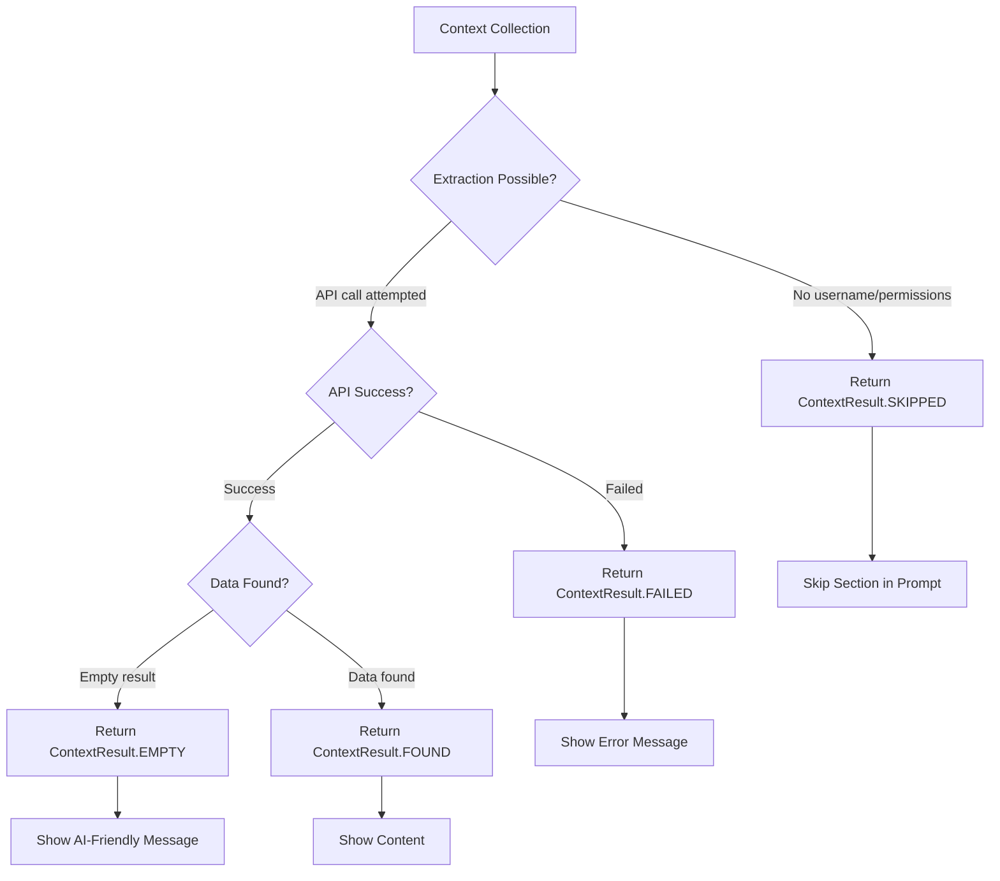
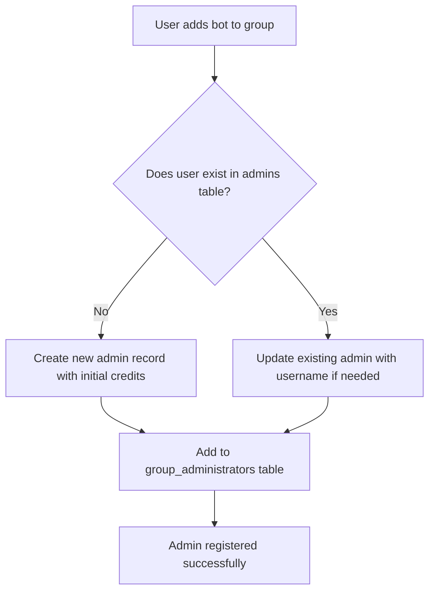
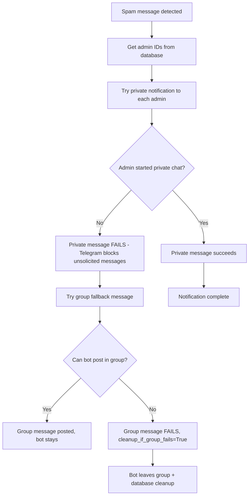
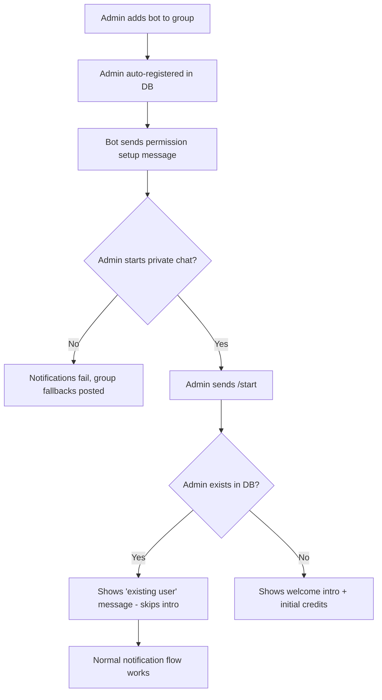

## System Patterns

- **i18n (Internationalization)**: Supported languages `ru` and `en`. Locale files in `src/app/locales/ru.yaml` and `en.yaml`. `t(lang, key, **kwargs)` for translations with fallback to other language if key missing. `resolve_lang(message_or_user, admin)` priority: `admin.language_code` → `user.language_code` → `"en"`. `normalize_lang()` maps `en-US` → `en`, unknown → `"en"`. `/lang` command lets admins switch. `Administrator` model has `language_code` (migration `--add-language-code`). LLM spam classification and private chat prompts use admin language for explanations. **Help section inline buttons**: `callback_data` equals the locale key (e.g. `help.getting_started`, `help.training`); allowlist `HELP_PAGE_CALLBACK_KEYS` in `src/app/i18n.py`; handler filters with `F.data.in_(HELP_PAGE_CALLBACK_KEYS)`. **Static key audit (dev/test only)**: `tests/support/i18n_keys_audit.py` — AST scan of `src/app` plus known dynamic keys vs YAML string leaves; CLI `python3 scripts/audit_i18n.py`; pytest `tests/test_i18n_keys_audit.py`.
- **Runtime Architecture**: `aiohttp` web application exposes Telegram webhook at `/process-tg-updates` (POST only) and health at `/health`. Traefik routes only these paths; other requests return 404 at edge. Updates forwarded to shared `aiogram` dispatcher hosted in `src/app/handlers`. Execution wrapped with `logfire` spans for observability and guarded by timeout/error helpers. Logfire metrics (histograms and gauges) initialized once at module level to ensure proper recording. Handler return values determine logfire span tags - handlers must return descriptive strings to avoid "_ignored" tagging. **Outbound HTTP reuse**: LLM calls share one module-level `ClientSession` + `TCPConnector` in `common/llms.py` (`close_llm_http_resources` on shutdown); `McpHttpClient` holds one session per instance (`close_mcp_http_client` on shutdown) to avoid per-request session allocation.
- **Bot Composition**:
  - `src/app/common` encapsulates integrations: Telegram bot client, LLM providers, notifications, and shared utilities.
- `src/app/spam` contains spam detection and context collection: classifier logic, user profile analysis, story processing, and message context extraction. Shared dataclasses and type definitions live in `src/app/types.py`.
  - `src/app/handlers` are organized by intent with modular substructure:
    - **Core handlers** by type (callbacks, commands, payments, spam handling)
    - **Message processing modules** under `handlers/message/`:
      - `pipeline.py` - Core moderation pipeline orchestration
      - `validation.py` - Message validation and permission checks
      - `channel_management.py` - Channel-specific operations and notifications
    - All handlers register with the dispatcher via side effects on import.
- **Data Access Layer**: `src/app/database` offers explicit operation modules (admins, groups, messages, spam examples) built atop a PostgreSQL connection helper, keeping SQL isolated from business logic. Asyncpg pool uses modest `max_size` (5) suited to webhook concurrency (handler plus occasional background work).
- **Spam Decision Flow**: Updates route through filters that skip admins/service messages and edited messages.
  - **Text Analysis**: Message content is analyzed by LLM. Spam system prompt and live requests use unified JSON format: few-shot examples `{"examples": [{"input": {...}, "label": {"is_spam": bool, "confidence": int}}]}`, live request `{"message": str, "user_name": str|null, "user_bio": str|null, "linked_channel": str|null, "stories": str|null, "reply_context": str|null, "account_signals": str|null}`. Built by `format_spam_example_input`, `add_spam_examples`, and `format_spam_request` in `prompt_builder.py`. Calibration guardrails explicitly require clear evidence for high-confidence spam (90+), discourage stacking weak absence signals, and prefer medium confidence for ambiguous mixed-signal cases.
  - **Context Enrichment**:
    - **Unified Sender Metadata Collection**: `collect_sender_context` consolidates all sender context gathering and basic metadata extraction (name, bio) in a single function, eliminating the previous split between context collection and metadata extraction. For user senders, fetches bio via Telegram API; for channel senders, uses chat description as bio.
    - **Linked Channel**: Collected in order: profile linked > first mention in bio > first mention in message. `LinkedChannelSummary` includes `channel_source` ("linked"|"bio"|"message") and `channel_id`. **MTProto ID-Query Prohibition**: Linked channels must NEVER be queried in MTProto by ID alone. Always use username—querying by ID causes "chat not found" (deleted, private, or no-access channels). When only ID is available, resolve to username first or skip MTProto collection. Checks for suspicious channel stats (low subs, new channel) via MTProto AND analyzes recent post content for spam indicators (porn, ads, scams). **Unified context collection** enables analysis for both user profiles AND channel senders. On-demand user bot subscription enables collection for users without usernames (only for public channels with usernames). **Onboarding Optimization**: New-user `/start` handler uses Bot API `get_chat()` to safely fetch `personal_chat` (linked channel) and `bio` before attempting MTProto, avoiding entity resolution errors for users without usernames. **Display**: All user-facing channel/group mentions use `format_chat_or_channel_display(title, username)` for consistent "Title (@username)" format.
    - **User Stories**: Fetches all active user stories via MTProto `stories.getPeerStories` (not just pinned ones) to detect hidden spam payloads (links, scam offers) in profiles. **Unified subscription system** ensures availability for all users.
    - **Account Age**: Estimates account age via User ID range and checks profile photo date via `users.getFullUser` to penalize brand new accounts (ID > 6B, recent photo).
    - **Discussion Thread Context**: For messages in discussion groups linked to channels, **optimized peer resolution** skips user bot subscription (since discussion groups may be private) and uses **thread-based reading** via `messages.getReplies` to establish MTProto peer resolution for users without usernames. **`establish_context_via_thread_reading`**: When `main_channel_id` / `main_channel_username` are present (from `reply_to_message.sender_chat` channel), **peer** is the **main channel** (username preferred via `get_mtproto_chat_identifier`); **msg_id** order: `original_channel_post_id` (`forward_from_message_id`), then `message_thread_id` / `reply_to_message_id`. If main channel is unknown, **peer** is the discussion group (legacy path). **Forum vs Discussion Distinction**: Correctly distinguishes between forum topic messages (`is_topic_message: true`) and discussion thread messages using the `is_topic_message` field, applying appropriate context collection strategies for each. **Main Channel Derivation**: For discussion thread messages (replies to channel posts), main channel information is extracted directly from `reply_to_message.sender_chat` rather than relying on `chat.linked_chat_id`, providing more reliable channel identification. **PeerResolutionContext Fields**: `main_channel_id` / `main_channel_username` for semantic clarity. **Synchronous Context Creation**: `create_peer_resolution_context_from_message` is now synchronous for the main extraction logic, with async API calls moved to the caller when needed, reducing unnecessary async overhead. **Message Object Optimization**: Context collection functions accept either full message objects or individual parameters, eliminating redundant field extraction and improving maintainability across different calling contexts (message processing vs. callbacks).
  - **Decision**: LLM scores content based on text, profile bio, linked channel stats/content, stories, and account age. Uses Cloudflare AI Gateway for all LLM operations (spam classification and private chat).
  - **Action**: LLM returns `is_spam` (bool) and `confidence` (0–100). Four outcome bands: (1) is_spam=False, confidence ≥90%: approve user. (2) is_spam=False, confidence <90% (low-confidence not-spam): send for review — deduct APPROVE_PRICE, optimistic add to approved_members, notify admins with "Low confidence" title and "Удалить"/"Не спам" buttons. Returns `message_low_confidence_review`. (3) is_spam=True, confidence <90% (low-confidence spam): notify admins, never auto-delete. (4) is_spam=True, confidence ≥90% (high-confidence spam): auto-deletion/ban if admin has delete_spam=True, else notifications only. Threshold configurable via `spam.high_confidence_threshold` (default 90). `handle_spam` accepts `skip_auto_delete` and `is_low_confidence_not_spam` for review flows. The previous `spam_score > 50` rule was removed; spam/ham is now determined by `is_spam` directly.
  - **Permission Failures**: "message can't be deleted" errors trigger admin notifications with private→group fallback. **No-Rights Grace Period**: When bot has no required rights (delete_messages, restrict_members), it records `no_rights_detected_at` on groups, notifies admins once, and leaves after `no_rights_grace_days` via daily job. Detection points: permission error (spam delete, service message delete), bot added without rights, permission update (rights revoked). Flag cleared when rights restored. Config: `billing.no_rights_grace_days`.
  - **Command Handling Policy**: All bot commands (except /help) are only accepted in private chats. Commands sent in group chats are ignored and deleted to prevent other users from accidentally triggering them. /help commands in groups display a message directing users to start a private conversation with the bot.
- **Callback Button UX Pattern**: For action-completion callbacks (e.g. confirm delete, add example, change language), when the user presses a callback button: (1) Remove the inline keyboard from the bot message (`reply_markup=None`); (2) Edit the message to append or display a line reporting that the action was done. **Exception**: When the callback triggers a new message that provides immediate feedback (e.g. invoice for `buy_stars`), leave the original message as-is. Help navigation callbacks (`help.{page}` keys, `help_back`) swap message content and keyboard—different UX. Implemented in: `handle_lang_set_callback`, `handle_spam_ignore_callback`, `handle_spam_confirm_callback`, `process_spam_example_callback`.
- **Add-to-Group Deep Links**: `get_add_to_group_url()` returns `https://t.me/{bot_username}?startgroup&admin=delete_messages+restrict_members` for one-click bot add with pre-granted permissions. Used in landing CTAs, help messages, permission instructions, deactivate and low-balance flows. Bot username from `config.system.bot_username`. /start with param (landing, setup_*) in groups triggers brief ready message.
- **Message Lookup Cache (PostgreSQL)**: Replaces former Logfire-based lookup. Table `message_lookup_cache` stores metadata (chat_id, message_id, effective_user_id, message_text, reply_to_text) and classification context (stories_context, account_signals_context) for all processed messages. Saved at two points: (A) when approved user message is skipped (`message_known_member_skipped`), (B) after full `is_spam` pipeline. When admin forwards a message to add spam example, `find_message_by_text_and_user` looks up in PostgreSQL. If stories/account_signals are empty (approved-user case), `collect_user_context` is called on-demand. TTL 7 days, cleaned by scheduled job.
- **User Mode Control**: /mode command allows users to toggle between notification-only and auto-deletion modes (private chat only).
- **Billing & Credits**: Telegram Stars payments handled by dedicated handlers coupled with database operations that maintain balances, histories, and automatic moderation toggles when credits drop. **Scheduled Jobs (Unified)**: Single background loop `scheduled_jobs_loop` in `src/app/background_jobs/scheduled_tasks.py` runs daily. It executes: (1) low balance checks (week-ahead warning, depletion timeline day 1/6/7, leave sole-payer groups), (2) **no-rights grace period** (leave groups where bot has no delete/ban rights past `no_rights_grace_days`), (3) cache cleanups (message_lookup_cache 7d, message_history 24h, pending spam_examples 3d). `credits_depleted_at` and `low_balance_warned_at` on administrators; `no_rights_detected_at` on groups. Migration: `--add-low-balance-columns`, `--add-no-rights-column`.
- **Context Collection**: Unified system handles both user profiles and channel senders. User context includes stories, linked channels, and account age. Channel senders are analyzed as linked channels with subscriber stats, post history, and content analysis. On-demand user bot subscription enables collection for users without usernames (only for public channels with usernames). Private channels without usernames are gracefully skipped.
  - **MTProto Peer Context Establishment**: Critical preparation phase for collecting user context when usernames are unavailable. System establishes MTProto peer resolution by strategically reading messages to build entity relationships in the MTProto session. **Channel-Linked Discussion Threads**: `establish_context_via_thread_reading` uses `messages.getReplies` with **peer = main channel** when `main_channel_*` is populated; avoids resolving private discussion supergroups by bare id. **msg_id** uses `original_channel_post_id` when available. **Regular Groups & Forum Topics**: Use optimized `messages.getHistory` with membership pre-check to avoid unnecessary ~1.2s join operations for already-joined chats. **Membership Pre-check**: Fast `messages.getHistory` call (~0.1s) checks if user bot is already member before attempting join. **Error Classification (Option 2B)**: Distinguishes permanent errors (`CHAT_PRIVATE`, `USER_NOT_PARTICIPANT`, invalid IDs) from transient errors (network, timeout) to determine join strategy. **Strategic Reading**: `messages.getReplies` for thread-based context (channel peer when known), `messages.getHistory` for regular groups and forum topics. Distinguishes between forum topics (`is_topic_message: true`) and discussion threads using Telegram Bot API fields for optimal peer resolution and comprehensive spam analysis. **Private Chat Handling**: Chats without usernames return `False` immediately (no join possible).
- **Channel Message Handling**: Messages sent on behalf of channels (sender_chat present) are moderated using the channel's ID (`sender_chat.id`) as the effective user ID. This prevents the generic "Channel Bot" user (136817688) from being approved and whitelisting all channel spam. The system distinguishes between linked channels (auto-forwards) and channel spam using `check_skip_channel_bot_message`.
- **Configuration & Startup**: `.env` loaded in `src/app/main.py`, logging initialized before dispatcher registration (with `SKIP_LOGFIRE`/pytest detection skipping Logfire so local tests keep console output). Web app run via `aiohttp.web`. Tests rely on `pytest` with fixtures under `tests/` mirroring production modules.
- **Testing Structure**:
  - **Unit Tests**: Fast, reliable tests using mocked dependencies and local test databases (SQLite/PostgreSQL). Run during deployment (83 tests).
  - **Integration Tests**: Tests requiring external services (Telegram API) stored in `tests/integration/`. Excluded from deployment via `@pytest.mark.integration`.
  - **Test Execution**: `pytest` with `--maxfail=1 --exitfirst -q` during deployment, only unit tests pass (93 total).
- **LLM Model Evaluation**:
  - **Evaluation Script**: `scripts/eval_llm_models.py` provides comprehensive testing infrastructure for spam classification models.
  - **Balanced Test Cases**: Automatically balances spam vs legitimate examples from database to prevent skewed accuracy metrics.
  - **Model Isolation**: Temporarily overrides MODELS list to test individual models without affecting global state.
  - **Hierarchical Progress Bars**: Uses `tqdm` with `position` parameters (0 for models, 1 for test cases, `leave=False` for inner bars) to prevent display conflicts.
  - **Results Storage**: Automatically saves complete evaluation results to `eval_results/` directory as timestamped JSON files with full metadata.
  - **DRY Architecture**: Helper functions eliminate repetitive code for error handling, formatting, and calculations.
- **Notification System**: Admin notifications use private→group fallback with optimized bot detection. Pre-filtered admin lists skip expensive API calls (assume_human_admins=True), while untrusted lists use full API validation. Bot removal events trigger enhanced logging showing who performed the removal. Database operations separated from business logic with dedicated cleanup functions. Logfire instrumentation provides automatic start/finish logging with argument extraction and return value recording.
- **MTProto Userbot Notifications**: When spam is blocked and a channel is discovered during context collection (either from channel-sender spam or linked channels on human spammers), the system sends promotional notifications via MTProto userbot directly to the spammer (if human sender with linked channel) or to administrators of the spamming channel (if channel sender). This leverages existing `channels.getFullChannel` API responses to extract human admin lists from spamming channels without additional calls, with user data stored directly in `LinkedChannelSummary` for clean data organization. Promoting the bot to channel promoters who are actively posting spam. Notifications include bot website and channel links for increased reach.
- **Channel-Add Userbot Fallback**: When the bot is added to a channel (instead of a discussion group), the primary flow notifies admins via Bot API and leaves the channel. If that fails (e.g. `TelegramForbiddenError` "bot is not a member" when the bot was removed before processing), the system falls back to a userbot DM to the adding user when they have a username. The userbot message includes a preamble explaining who sent it (@ai_antispam_blocker_bot team) and why it comes from an unknown account, since the recipient did not start a chat with the bot. Uses `send_userbot_dm` in `userbot_messaging` and `build_channel_instruction_userbot_message` for the context-rich fallback content.
- **Database Integrity**: Stored procedures include bot filtering (negative IDs, known bot accounts). Admin lists prevent bot contamination through API validation and database-level checks. Cleanup operations properly separate connection management from business logic.
- **Spam Examples Pending Flow**: Unified `spam_examples` table with `confirmed` boolean. On notify: `insert_pending_spam_example` stores full payload (text, name, bio, linked_channel, stories, reply, account_signals_context, effective_user_id) and returns id. "Не спам" button uses `mark_as_not_spam:{id}`. Callback parses id, calls `confirm_pending_example_as_not_spam`; if row found, unban/add_member/edit notification; if None, log and skip (no fallback). "Удалить" (delete_spam_message) button in notify mode: calls `confirm_pending_example_as_spam(chat_id, message_id, admin_id)` to set `confirmed=true`, `admin_id`, `score=100`; deletes the original message and **bans the spammer** (user or channel). Both confirmation paths set `admin_id` so examples are admin-specific, not common. `spam_examples.text` contract: only original message content, no alert wrappers. Pending rows auto-deleted after 3 days.
- **Context Preparation Contract**: All context preparation code (stories, account age, linked channel, reply context) MUST follow a strict ContextResult contract using status enums to distinguish between extraction states:

### Context State Contract

**ContextResult Status Enum:**
- **`FOUND`** - **Data Found**: Context extraction succeeded and found data. Section is **included** in prompt with actual content.
- **`EMPTY`** - **Checked But Absent**: Context extraction succeeded but found no data (user has no photo/stories/channel). Section is **included** in prompt with user-friendly message.
- **`FAILED`** - **API Error**: Context extraction failed due to API errors. Section is **included** in prompt with error message.
- **`SKIPPED`** - **Not Attempted**: Context extraction was not attempted (missing username, no permission, etc.). Section is **omitted** from prompt entirely.

**AI-Friendly Messages for `EMPTY` Status:**
- Account Age: `"no photo on the account"`
- Stories: `"no stories posted"`
- Linked Channel: `"no channel linked"`
- Reply Context: `"not a reply"` (or similar)

**Implementation Rules:**

1. **Collection Functions** (e.g., `collect_user_stories()`, `collect_user_context()`):
   - **ALWAYS return `ContextResult` object** - never return raw strings or None
   - Use `ContextStatus.SKIPPED` if extraction cannot be attempted (no username, missing permissions)
   - Use `ContextStatus.FAILED` if API calls fail (network errors, rate limits, auth errors)
   - Use `ContextStatus.EMPTY` if extraction succeeded but found no data (empty list, no photo, no channel)
   - Use `ContextStatus.FOUND` with content if extraction succeeded and data found

2. **Prompt Formatting** (`format_spam_request()`):
   - **Omit section entirely** if `status == "SKIPPED"` (not attempted)
   - **Include section with user-friendly message** if `status == "EMPTY"`
   - **Include section with error message** if `status == "FAILED"`
   - **Include section with content** if `status == "FOUND"`

4. **State Flow Example:**

```mermaid
flowchart TD
    A[Context Collection] --> B{Extraction Possible?}
    B -->|No username/permissions| C[Return ContextResult.SKIPPED]
    B -->|API call attempted| D{API Success?}
    D -->|Failed| E[Return ContextResult.FAILED]
    D -->|Success| F{Data Found?}
    F -->|Empty result| G[Return ContextResult.EMPTY]
    F -->|Data found| H[Return ContextResult.FOUND]

    C --> I[Skip Section in Prompt]
    E --> J[Show Error Message]
    G --> K[Show AI-Friendly Message]
    H --> L[Show Content]
```

**Critical Rules:**
- **ALWAYS return ContextResult** - collection functions must wrap results in ContextResult objects
- **Use appropriate status enums** - distinguish between SKIPPED (not attempted), FAILED (API error), EMPTY (checked but no data), FOUND (data found)
- **Prompt formatting handles all statuses** - no special handling needed in calling code
- **SKIPPED vs FAILED distinction** - SKIPPED for missing prerequisites (no username), FAILED for API/technical errors
- **ContextResult reconstruction** - Database strings are converted back to full ContextResult objects with proper status

- **Spam Examples Context Storage**: Context elements are stored as TEXT columns in spam_examples database for backward compatibility, but converted to ContextResult objects during classification:
  - **Database Storage Format**:
    - **NULL**: Historical examples or skipped context - converted to `None` (no ContextResult created)
    - **'[EMPTY]' string**: Context checked but empty - converted to `ContextResult(status=EMPTY)`
    - **Content string**: Context found - converted to `ContextResult(status=FOUND, content=stored_string)`
  - **Context Reconstruction**: When loading examples for prompts, stored strings are converted back to ContextResult objects with appropriate status enums
  - **Storage Logic**: Context collection results are serialized to strings for database storage but maintain full status information through ContextResult reconstruction
- **Observability & Incident Response**: All warnings/errors funnel through the standard logging stack with full tracebacks; `logger.warning` must include `exc_info=True` when exceptions exist. Critical failures notify the admin chat, and recurring issues get grouped for trend analysis and frequency tracking.
- **Telegram Messaging Conventions**: Outbound messages respect Telegram limits and escape reserved characters for HTML mode. AI prompts include explicit HTML formatting instructions.
- **Graceful Shutdown**: On SIGINT/SIGTERM, `aiohttp` triggers shutdown hooks that clean up resources in order: stop background tasks, close bot session, close DB pool.
- **Admin Registration & Notification Behavior**: Admins are auto-registered when they add the bot to groups, but notifications fail for admins who haven't started private chats. See Admin Registration Flow diagram below.

## Admin Registration & Notification Flow

### When Admins Get Added to Database

```mermaid
flowchart TD
    A[User adds bot to group] --> B{Does user exist in admins table?}
    B -->|No| C[Create new admin record with initial credits]
    B -->|Yes| D[Update existing admin with username if needed]
    C --> E[Add to group_administrators table]
    D --> E
    E --> F[Admin registered successfully]
```

**Key Points:**
- Admin registration happens automatically when bot is added to group
- No requirement for admin to have started private chat
- Initial credits (100) assigned to new admins
- Admin can be registered without ever interacting with bot privately

### Notification Failure Scenario

```mermaid
flowchart TD
    A[Spam message detected] --> B[Get admin IDs from database]
    B --> C[Try private notification to each admin]
    C --> D{Admin started private chat?}
    D -->|No| E[Private message FAILS - Telegram blocks unsolicited messages]
    D -->|Yes| F[Private message succeeds]
    E --> G[Try group fallback message]
    F --> H[Notification complete]
    G --> I{Can bot post in group?}
    I -->|Yes| J[Group message posted, bot stays]
    I -->|No| K[Group message FAILS, cleanup_if_group_fails=True]
    K --> L[Bot leaves group + database cleanup]
```

**Failure Impact:**
- Private notifications fail silently for admins who haven't started chats
- Group fallback messages posted instead (confusing UX)
- Bot may exit group if it can't post fallback messages
- Core spam detection/deletion still works, but notifications are broken

### Admin Onboarding Experience

```mermaid
flowchart TD
    A[Admin adds bot to group] --> B[Admin auto-registered in DB]
    B --> C[Bot sends permission setup message]
    C --> D{Admin starts private chat?}
    D -->|No| E[Notifications fail, group fallbacks posted]
    D -->|Yes| F[Admin sends /start]
    F --> G{Admin exists in DB?}
    G -->|Yes| H[Shows 'existing user' message - skips intro]
    G -->|No| I[Shows welcome intro + initial credits]
    H --> J[Normal notification flow works]
```

**UX Problems:**
- Admins miss onboarding experience (welcome text, feature explanation)
- Get confusing group messages instead of clean private notifications
- Appear to have "broken" bot until they start private chat
